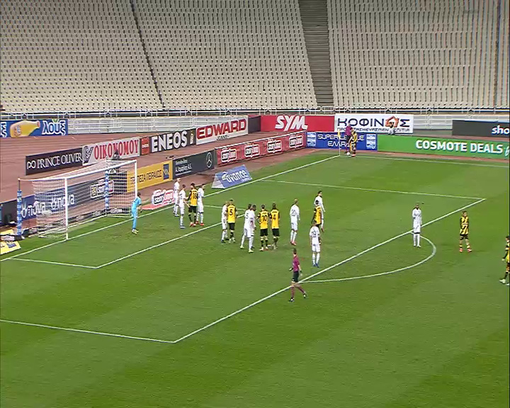

# H-RANSAC
## General idea
A generalized implementation of RANSAC (Random Sample Consensus), $H$-RANSAC, for homography estimation. In this implementation, two logical tests (one ad-hoc and one post-hoc) are used based on the geometry of random selected points on each iteration. The necessary iterations of the algorithm are calculated and homography matrix, $H$, is estimated.
Code is provided both in Python and MATLAB. For more details, check the published [paper](https://doi.org/10.48550/arXiv.2310.04912).
An example of the usage of H-RANSAC is available just by running the script mainExample.m in matlab_implementation file. 

## Ad-hoc and post-hoc criteria
In order to retrieve homography image transformations from sets of points without descriptive local feature vectors to allow for point pairing, we introduce two logical criteria. We propose a robust criterion that rejects implausible point selection before each iteration of RANSAC, based on the type of the quadrilaterals formed by random point pair selection (convex or concave and (non)-self-intersecting). To cover some practical applications we allow the points to be (optionally) labelled in two classes. Also, a similar post-hoc criterion rejects implausible homography transformations is included at the end of each iteration.
Both criteria are calculating the value Q, based on the below equations, for each shaped quadrilateral

$Q=|\sum_{i} sgn(v^i_z)|, i=1,2,3,4$,

where

$v^i=(p_i-p_p) \times (p_n-p_i)$, 

with $p_p, p_n$ be the previous and next edges that shapes two consecutive vertices with edge $p_i$

An example of different Q values, is depicted on the below figure.
 
 

## Estimated iterations
Let image A and image B be a pair of images that a homography transformation can be applied. Also, let the ordered 4-points $p^A$, $p^B$ be randomly selected from image $A$ and $B$, respectively. The two quadrilaterals that are formed from $p^A$ and $p^B,$ have Q-values equal to $Q_A,Q_B$ respectively. If $Q_A=Q_B$ then the iteration proceeds, otherwise new points are selected.
 
 To gain an insight of the expected reduction in the number of iterations of the proposed $H$-RANSAC, we simulated the generation of quadrilaterals and calculated the number of occurrences of each $Q-$value. After experimentations, the number of RANSAC iterations are expected to be reduced approximately by a factor of 3, using the Q criterion. For thurther details, you can study the published article ...

 ## Results
 The proposed methodology is compared with variants of RANSAC algorithm (like VSAC, MAGSAC, Graph-Cut or DEGENSAC), utilizing feature extraction techniques like SIFT, ORB or more recent deep learning techniques like SuperPoint and SuperGlue.
 The dataset that was used to extract and validate our theoritical proposal, contains football images acquired from 12 different cameras (capturing images at the same time) with different camera positions, viewing vector and zoom factor. An example of the resulted image, as well as the images that used are displayed below.

  

 The reference frame for the specific timestamp is the below
 
 

 

And the result, if we combine the reference frame with the transformed images

 

If you use the above software or part of it in your work, please cite it using the below
>Nousias, G., Delibasis, K., & Maglogiannis, I. (2023). H-RANSAC, an algorithmic variant for Homography image transform from featureless point sets: application to video-based football analytics. arXiv [Cs.CV]. Retrieved from http://arxiv.org/abs/2310.04912
